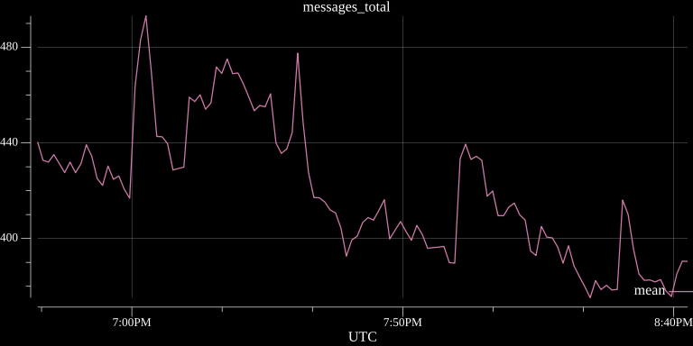

# tsplot
[](https://goreportcard.com/report/github.com/bitly/tsplot)
[](https://pkg.go.dev/github.com/bitly/tsplot)

## Authentication
This package makes no effort to assist in authentication to the Google APIs.
Instead, it will expect the caller to supply an authenticated client.

More information on authentication can be found in the official [Google Cloud documentation](https://cloud.google.com/docs/authentication).
```
func main() {

... snip ...

    start := time.Now().Add(-1 * time.Hour)
    end := time.Now()
    
    // create new request
    request := monitoringpb.ListTimeSeriesRequest{
	Name:   fmt.Sprintf("projects/%s", project),
	Filter: query,
	Interval: &monitoringpb.TimeInterval{
	    EndTime:   timestamppb.New(et),
	    StartTime: timestamppb.New(st),
	},
	Aggregation:          nil,
	SecondaryAggregation: nil,
	View:                 monitoringpb.ListTimeSeriesRequest_FULL,
    }
    
    // execute the request and get the response from Google APIs
    tsi := GoogleCloudMonitoringClient.ListTimeSeries(context.Background(), request)
    
    // Create the plot from the GAPI TimeSeries
    plot, _ := tsplot.NewPlotFromTimeSeriesIterator(tsi, "", nil)
    
    // Save the new plot to disk.
    plot.Save(8*vg.Inch, 4*vg.Inch, "my_plot.png")
}
```

### Example generated graphs:
Query across multiple time series with mean reducer:  


